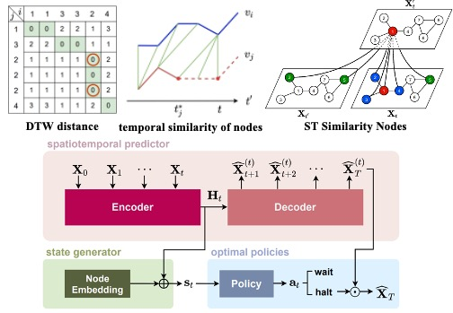

Shao, W., Kang, Y., Peng, Z., Xiao, X., Wang, L., Yang, Y., & Salim, F. D. (2024, August). STEMO: Early Spatio-temporal Forecasting with Multi-Objective Reinforcement Learning. In Proceedings of the 30th ACM SIGKDD Conference on Knowledge Discovery and Data Mining (pp. 2618-2627).
